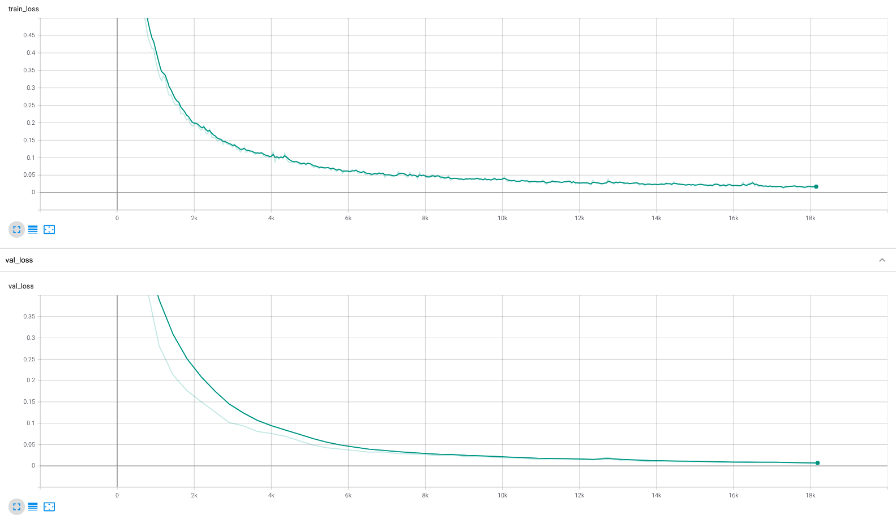

# Seq2Seq - Polynomial Expansion
This repo contains an implementation of a seq2seq [transformer](https://arxiv.org/abs/1706.03762) using PyTorch Lightning. The implementation is heavily borrowed from [bentrevett/pytorch-seq2seq](https://github.com/bentrevett/pytorch-seq2seq/blob/master/6%20-%20Attention%20is%20All%20You%20Need.ipynb), with a few key differences:
- This repo tests the model against a toy dataset of polynomial expansions (see `expand.md` or `The Problem` section below), rather than english to german translation
- Instead of using `torchtext`, I've implemented my own in-house text to tensor processing
- The model `Seq2Seq` top layer module is implemented using PyTorch Lightning
- I've added batch prediction, which speeds up prediction by orders of magnitudes

I'm hoping to add an example notebook of how to use the repo for english to german translation.

## The Problem
Implement a deep learning model that learns to expand single variable polynomials, where the model takes the factorized sequence as input and predict the expanded sequence. For example:

* `n*(n-11)=n**2-11*n`
* `n*(n-11)` is the factorized input
* `n**2-11*n`  is the expanded target

The expanded expressions are commutable, but only the form provided is considered correct. Here are some additional examples:

```
(c-17)*(5*c-26)=5*c**2-111*c+442
(5-2*t)*(-6*t-26)=12*t**2+22*t-130
-3*x**2=-3*x**2
(3*sin(x)-3)*(5*sin(x)+6)=15*sin(x)**2+3*sin(x)-18
-4*t*(8*t-14)=-32*t**2+56*t
(y+22)*(2*y-32)=2*y**2+12*y-704
(-5*s-20)*(s-15)=-5*s**2+55*s+300
(15-4*y)*(7*y+27)=-28*y**2-3*y+405
28*y**2=28*y**2
k*(8*k+23)=8*k**2+23*k
```

The full dataset (`data/data.txt`) contains a million examples.

## Reproduce
Split data into train and test set (use `--help` for more options):
```shell
python data.py
```

Train the model (use `--help` for more options):
```shell
python train.py \
    "models/best" \
    --gpus 1 \
    --gradient_clip_val 1 \
    --max_epochs 10 \
    --val_check_interval 0.2
```

Evaluate model on test set (use `--help` for more options):
```shell
python evaluate.py models/best
```

Run unit tests:
```shell
python -m unittest tests.py
```

## Model Accuracy
The model is evaluated against a **strict string equality** between the predicted target sequence and the groud truth target sequence. The model achieved an accuracy of `0.915`.


